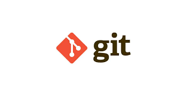
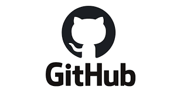

# 👋 Oi, eu sou o Meta Mace!

Sou estudante finalista de **Ciência da Computação**, restando apenas uma disciplina para a conclusão do bacharelado. Sou focado em desenvolvimento **Back-End / Python**, construindo softwares e ferramentas com foco em automação, engenharia de software e manipulação de sistemas de arquivos.

---

### 🚀 Sobre mim

* 🎓 **Ciência da Computação (Fase de Conclusão)** - Faculdade Descomplica (Falta apenas 1 matéria para formar).
* 🏛️ Histórico acadêmico com base sólida pelo Instituto Federal da Bahia (IFBA).
* ⚙️ Desenvolvendo atualmente o **V-Shredder (Destruidor de Metadados)**, uma aplicação desktop feita em Python voltada para segurança e privacidade de dados.
* 🌱 Aprofundando conhecimentos em Engenharia de Software, Estruturas de Dados de alto nível e Arquitetura de Sistemas.
* 📫 Como me encontrar: [lucasornelas705@gmail.com](mailto:lucasornelas705@gmail.com)

---

### 🛠️ Tecnologias e Ferramentas

Aqui estão as tecnologias que utilizo nos meus projetos e estudos diários:

   <b>Python</b>   
   <b>Git</b>   
   <b>GitHub</b>   
   <b>Linux</b>

